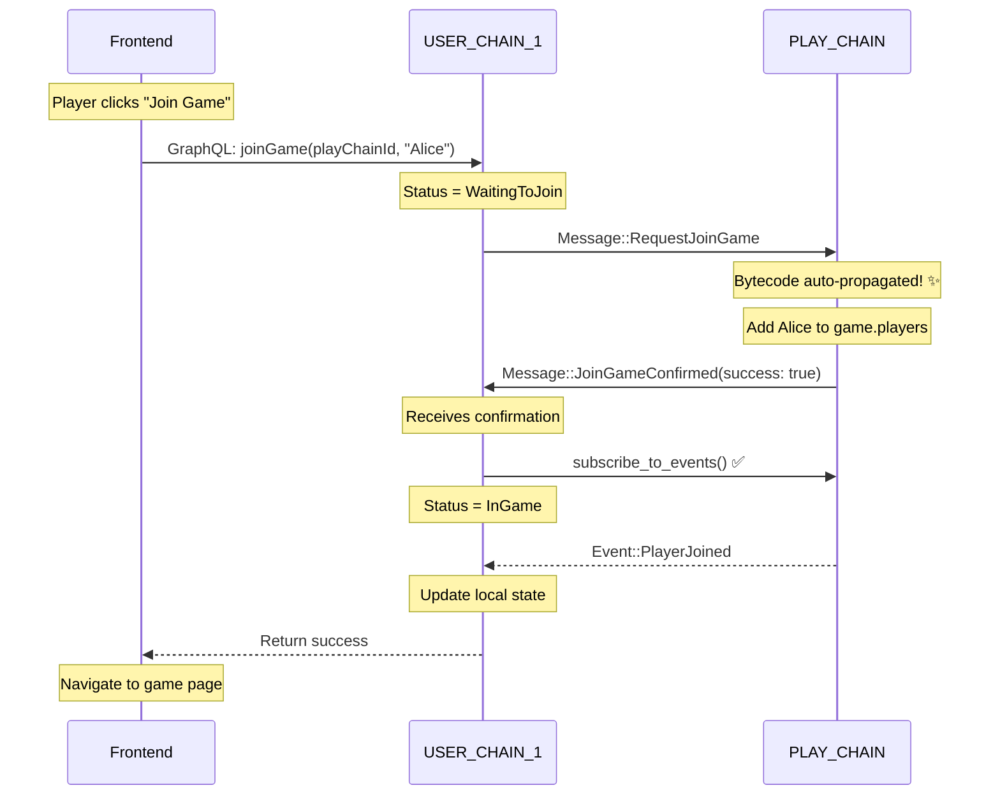
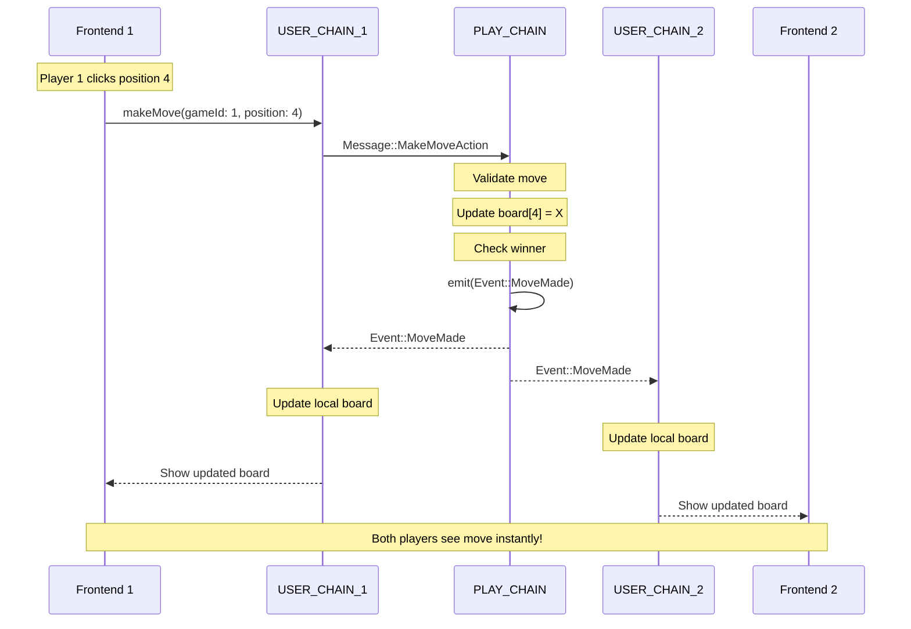
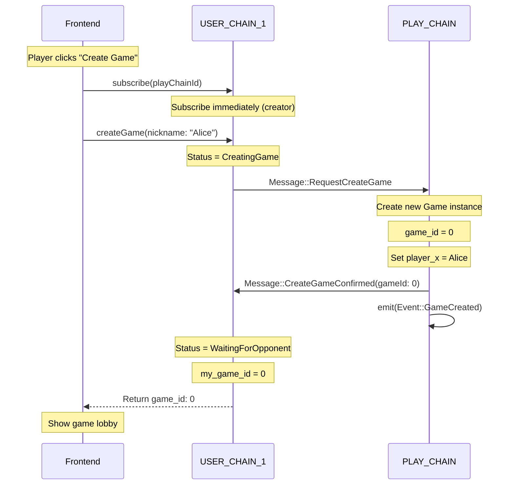

# 🗺️ Drawn - Visual Architecture Map

> **Quick Reference:** Visual diagrams and flow charts for the Drawn project

---

## 🎯 Current State vs Target State

### Current: Single-Chain Architecture

```
┌────────────────────────────────────────────────────────┐
│                     SINGLE CHAIN                        │
│                                                          │
│  ┌─────────────────────────────────────────────────┐  │
│  │           TicTacToeState                        │  │
│  │                                                  │  │
│  │  • games: MapView<u64, Game>                    │  │
│  │  • player_stats: MapView<String, PlayerStats>   │  │
│  │  • next_game_id: RegisterView<u64>              │  │
│  │  • total_games: RegisterView<u64>               │  │
│  └─────────────────────────────────────────────────┘  │
│                                                          │
│  ┌─────────────────────────────────────────────────┐  │
│  │           Operations                             │  │
│  │                                                  │  │
│  │  • CreateGame { player_x, player_o }            │  │
│  │  • MakeMove { game_id, player, position }       │  │
│  └─────────────────────────────────────────────────┘  │
│                                                          │
└──────────────────┬───────────────────────────────────┘
                   │
                   │ GraphQL Mutations & Queries
                   │
                   ▼
        ┌──────────────────────┐
        │   Frontend (React)    │
        │   • Mock data         │
        │   • Beautiful UI ✓    │
        │   • Not connected ✗   │
        └──────────────────────┘
```

**Issues:**
- ❌ Both players share same chain (no privacy)
- ❌ No real-time synchronization
- ❌ Frontend not connected to backend
- ❌ Can't scale to multiple games

---

### Target: Multi-Chain Architecture

```
┌─────────────────────────────────────────────────────────────────┐
│                    MULTIPLAYER ARCHITECTURE                      │
│                                                                   │
│  ┌────────────────┐              ┌────────────────┐            │
│  │ USER_CHAIN_1   │              │ USER_CHAIN_2   │            │
│  │ (Player 1)     │              │ (Player 2)     │            │
│  │                │              │                │            │
│  │ State:         │              │ State:         │            │
│  │ • user_status  │              │ • user_status  │            │
│  │ • my_game_id   │              │ • my_game_id   │            │
│  │ • subscribed   │              │ • subscribed   │            │
│  └────────┬───────┘              └────────┬───────┘            │
│           │                                │                     │
│           │    Messages (async)            │                     │
│           └────────────┬───────────────────┘                     │
│                        │                                         │
│                        ▼                                         │
│           ┌─────────────────────────┐                           │
│           │      PLAY_CHAIN         │                           │
│           │   (Authoritative)       │                           │
│           │                         │                           │
│           │ State:                  │                           │
│           │ • games: MapView        │                           │
│           │ • active_players        │                           │
│           │                         │                           │
│           │ Processes:              │                           │
│           │ • RequestJoinGame       │                           │
│           │ • RequestCreateGame     │                           │
│           │ • MakeMoveAction        │                           │
│           │                         │                           │
│           │ Emits:                  │                           │
│           │ • GameCreated           │                           │
│           │ • PlayerJoined          │                           │
│           │ • MoveMade              │                           │
│           │ • GameEnded             │                           │
│           └─────────────────────────┘                           │
│                        │                                         │
│                        │ Events (broadcast)                      │
│                        ▼                                         │
│           ┌─────────────────────────┐                           │
│           │  All Subscribed Chains  │                           │
│           │  (Real-time updates)    │                           │
│           └─────────────────────────┘                           │
│                                                                   │
└───────────────────────────────────────────────────────────────┘
```

**Benefits:**
- ✅ Each player has private chain
- ✅ PLAY_CHAIN is single source of truth
- ✅ Real-time updates via events
- ✅ Scales to many concurrent games

---

## 🔄 Complete Message Flow

### Flow 1: Player Joins Game



### Flow 2: Making a Move



### Flow 3: Game Creation



---

## 🏗️ Frontend Architecture

### Current Component Tree

```
App.tsx
├── Router
│   ├── Landing.tsx
│   │   └── Hero Section
│   │   └── CTA Buttons
│   │
│   ├── CreateProfile.tsx
│   │   └── Profile Form
│   │   └── Avatar Selection
│   │
│   ├── Dashboard.tsx
│   │   └── Stats Grid
│   │   └── Quick Actions
│   │
│   ├── CreateNFT.tsx
│   │   └── NFT Form
│   │   └── Preview
│   │
│   ├── Lobby.tsx
│   │   └── Available Games List
│   │   └── Create Game Button
│   │
│   ├── Game.tsx
│   │   ├── Match Header
│   │   │   ├── Player 1 Info
│   │   │   ├── VS Badge
│   │   │   └── Player 2 Info
│   │   ├── TicTacToe.tsx ⭐
│   │   │   └── Board (3x3 grid)
│   │   └── Winner Overlay
│   │
│   ├── MatchResult.tsx
│   │   └── Winner Display
│   │   └── Stats
│   │   └── Rewards
│   │
│   ├── Leaderboard.tsx
│   │   └── Rankings Table
│   │
│   └── Rewards.tsx
│       └── NFT Gallery
│
└── Providers
    ├── QueryClientProvider (TanStack Query)
    ├── TooltipProvider (shadcn/ui)
    ├── Toaster (Toast notifications)
    └── Router (React Router)
```

### Data Flow (After Connection)

```
┌─────────────────────────────────────────────────┐
│              Frontend Layer                      │
│                                                   │
│  ┌─────────────────────────────────────────┐   │
│  │  React Components                        │   │
│  │  • Game.tsx                              │   │
│  │  • TicTacToe.tsx                         │   │
│  └──────────┬──────────────────────────────┘   │
│             │                                    │
│             ▼                                    │
│  ┌─────────────────────────────────────────┐   │
│  │  Custom Hooks (To be created)           │   │
│  │  • useCreateGame()                       │   │
│  │  • useMakeMove()                         │   │
│  │  • useGameState()                        │   │
│  │  • useSubscribeEvents()                  │   │
│  └──────────┬──────────────────────────────┘   │
│             │                                    │
│             ▼                                    │
│  ┌─────────────────────────────────────────┐   │
│  │  GraphQL Client                          │   │
│  │  • endpoint: VITE_GRAPHQL_ENDPOINT       │   │
│  │  • mutations: POST requests              │   │
│  │  • queries: GET requests                 │   │
│  └──────────┬──────────────────────────────┘   │
└─────────────┼──────────────────────────────────┘
              │
              │ HTTP/HTTPS
              │
              ▼
┌─────────────────────────────────────────────────┐
│         Linera Node Service (Port 8080)          │
│                                                   │
│  GraphQL Endpoint:                               │
│  http://localhost:8080/chains/{CHAIN}/           │
│                         applications/{APP}       │
│                                                   │
│  • Mutations → execute_operation()               │
│  • Queries → service queries                     │
│  • Subscriptions → event streams                 │
└─────────────┬───────────────────────────────────┘
              │
              ▼
┌─────────────────────────────────────────────────┐
│            Smart Contract Layer                  │
│                                                   │
│  contract.rs                                     │
│  • execute_operation()  ← Mutations              │
│  • execute_message()    ← Cross-chain messages   │
│                                                   │
│  service.rs                                      │
│  • handle_query()       ← Queries                │
│                                                   │
│  state.rs                                        │
│  • Games storage                                 │
│  • Player stats                                  │
└──────────────────────────────────────────────────┘
```

---

## 📊 State Management Comparison

### Current State Schema

```rust
// contracts/src/state.rs

TicTacToeState {
    // Core game data
    next_game_id: RegisterView<u64>,        // Auto-increment
    games: MapView<u64, Game>,               // game_id → Game
    player_stats: MapView<String, PlayerStats>, // player → stats
    total_games: RegisterView<u64>,          // Counter
}

Game {
    game_id: u64,
    player_x: String,                        // ⚠️ Should be AccountOwner
    player_o: String,                        // ⚠️ Should be AccountOwner
    board: Vec<Option<PlayerSymbol>>,        // 9 cells
    current_turn: PlayerSymbol,
    status: GameStatus,                      // Active, XWins, OWins, Draw
    created_at: u64,                         // Timestamp
    winner: Option<String>,
}

PlayerStats {
    address: String,
    games_played: u64,
    games_won: u64,
    games_lost: u64,
    games_drawn: u64,
}
```

### Target State Schema (Multiplayer)

```rust
// For USER_CHAIN
TicTacToeState {
    // Existing (for PLAY_CHAIN compatibility)
    next_game_id: RegisterView<u64>,
    games: MapView<u64, Game>,
    player_stats: MapView<String, PlayerStats>,
    total_games: RegisterView<u64>,
    
    // NEW: USER_CHAIN specific
    user_status: RegisterView<UserStatus>,
    subscribed_play_chain: RegisterView<Option<ChainId>>,
    player_name: RegisterView<Option<String>>,
    my_current_game_id: RegisterView<Option<u64>>,
    
    // NEW: Tracking
    is_play_chain: RegisterView<bool>,
}

UserStatus {
    Idle,                    // Not in game
    CreatingGame,            // Waiting for create confirmation
    WaitingToJoin,           // Waiting for join confirmation
    InGame,                  // Active game
    WaitingForOpponent,      // Game created, need player 2
}
```

---

## 🎮 Game Logic Flow

### Win Condition Check

```
Board positions:
┌───┬───┬───┐
│ 0 │ 1 │ 2 │
├───┼───┼───┤
│ 3 │ 4 │ 5 │
├───┼───┼───┤
│ 6 │ 7 │ 8 │
└───┴───┴───┘

Winning patterns (8 total):
Rows:    [0,1,2] [3,4,5] [6,7,8]
Cols:    [0,3,6] [1,4,7] [2,5,8]
Diag:    [0,4,8] [2,4,6]
```

### Move Validation Logic

```rust
async fn execute_operation(&mut self, operation: Operation) {
    match operation {
        Operation::MakeMove { game_id, player, position } => {
            // 1. Get game
            let game = self.state.games.get(&game_id).await?;
            
            // 2. Validate game is active
            if game.status != GameStatus::Active {
                return Err("Game is not active");
            }
            
            // 3. Validate position (0-8)
            if position > 8 {
                return Err("Invalid position");
            }
            
            // 4. Validate cell is empty
            if game.board[position as usize].is_some() {
                return Err("Cell already occupied");
            }
            
            // 5. Validate correct player's turn
            let player_symbol = if player == game.player_x {
                PlayerSymbol::X
            } else if player == game.player_o {
                PlayerSymbol::O
            } else {
                return Err("Invalid player");
            };
            
            if player_symbol != game.current_turn {
                return Err("Not your turn");
            }
            
            // 6. Make move
            game.board[position as usize] = Some(player_symbol);
            
            // 7. Check winner
            if let Some(winner) = check_winner(&game.board) {
                game.status = match winner {
                    PlayerSymbol::X => GameStatus::XWins,
                    PlayerSymbol::O => GameStatus::OWins,
                };
                game.winner = Some(winner_address);
            }
            
            // 8. Check draw (all cells filled)
            else if game.board.iter().all(|cell| cell.is_some()) {
                game.status = GameStatus::Draw;
            }
            
            // 9. Switch turn
            else {
                game.current_turn = match game.current_turn {
                    PlayerSymbol::X => PlayerSymbol::O,
                    PlayerSymbol::O => PlayerSymbol::X,
                };
            }
            
            // 10. Save
            self.state.games.insert(&game_id, game);
        }
    }
}
```

---

## 🔌 Integration Points

### Environment Variables Needed

```bash
# frontend/.env

# Backend connection
VITE_GRAPHQL_ENDPOINT=http://localhost:8080/chains/CHAIN_ID/applications/APP_ID
VITE_CHAIN_ID=e476187f6ddfeb9d588c7b45d3df334d5501d6499b3f9ad5595cae86cce16a65
VITE_APP_ID=e476187f6ddfeb9d588c7b45d3df334d5501d6499b3f9ad5595cae86cce16a65abcdef...

# Optional: Multiplayer
VITE_PLAY_CHAIN_ID=...
VITE_USER_CHAIN_ID=...

# Optional: Features
VITE_ENABLE_NFT_REWARDS=true
VITE_ENABLE_LEADERBOARD=true
```

### GraphQL Hooks to Create

```typescript
// frontend/src/hooks/useLinera.ts

export const useCreateGame = () => {
  const mutation = useMutation({
    mutationFn: async ({ playerX, playerO }: CreateGameParams) => {
      const response = await fetch(GRAPHQL_ENDPOINT, {
        method: 'POST',
        headers: { 'Content-Type': 'application/json' },
        body: JSON.stringify({
          query: `
            mutation {
              createGame(playerX: "${playerX}", playerO: "${playerO}")
            }
          `
        })
      });
      return response.json();
    }
  });
  
  return mutation;
};

export const useMakeMove = () => {
  // Similar pattern...
};

export const useGameState = (gameId: number) => {
  const query = useQuery({
    queryKey: ['game', gameId],
    queryFn: async () => {
      // Fetch game state
    },
    refetchInterval: 1000, // Poll every second
  });
  
  return query;
};
```

---

## 🚀 Deployment Flows

### Single-Chain Deployment

```bash
#!/bin/bash
# run.bash

# 1. Start network
linera net up --with-faucet

# 2. Initialize wallet
linera wallet init --with-new-chain

# 3. Build contract
cd contracts
cargo build --release --target wasm32-unknown-unknown

# 4. Publish and create
linera project publish-and-create \
  --required-application-ids [] \
  --json-argument ""

# 5. Start service
linera service --port 8080

# 6. Start frontend
cd ../frontend
npm run dev
```

### Multi-Chain Deployment

```bash
#!/bin/bash
# run-multiplayer.bash

# 1. Start network
linera net up --with-faucet

# 2. Create wallet 1 (Player 1)
export WALLET_1=~/.config/linera/wallet.json
linera wallet init --with-new-chain --storage $WALLET_1

# 3. Create wallet 2 (Player 2)  
export WALLET_2=~/.config/linera/wallet2.json
linera wallet init --with-new-chain --storage $WALLET_2

# 4. Build and publish from wallet 1
linera --wallet $WALLET_1 project publish-and-create ...

# 5. Get PLAY_CHAIN_ID and APP_ID
PLAY_CHAIN_ID=$(linera --wallet $WALLET_1 wallet show | grep "Chain ID" | awk '{print $3}')

# 6. Subscribe wallet 2
linera --wallet $WALLET_2 subscribe $PLAY_CHAIN_ID

# 7. Start services
linera --wallet $WALLET_1 service --port 8080 &
linera --wallet $WALLET_2 service --port 8081 &

# 8. Start frontends
cd frontend
VITE_GRAPHQL_ENDPOINT=http://localhost:8080/... npm run dev -- --port 5173 &
VITE_GRAPHQL_ENDPOINT=http://localhost:8081/... npm run dev -- --port 5174 &
```

---

## 📈 Complexity Progression

### Level 1: Current (Single-Chain) ⭐
```
Frontend (Mock) ← → Backend (Working)
            Not connected
```

### Level 2: Connected Single-Chain ⭐⭐
```
Frontend ← GraphQL → Backend
    ✅ Working end-to-end
    ✅ No multiplayer yet
```

### Level 3: Multi-Chain ⭐⭐⭐
```
Frontend 1 ← → USER_CHAIN_1 ← → PLAY_CHAIN ← → USER_CHAIN_2 ← → Frontend 2
                                Events ↓
                            Both players synced
```

### Level 4: NFT Integration ⭐⭐⭐⭐
```
Same as Level 3 + NFT minting on wins
                  + Collections
                  + Achievements
```

---

## 🎯 Quick Decision Tree

```
Do you want to see something working ASAP?
├─ YES → Path A (Connect Frontend)
│         Timeline: 1-2 days
│         Effort: Low
│         Result: Working demo
│
└─ NO → Do you need true multiplayer?
        ├─ YES → Path B (Full Migration)
        │         Timeline: 1 week
        │         Effort: Medium
        │         Result: Scalable architecture
        │
        └─ LATER → Path C (Hybrid)
                    Week 1: Path A
                    Week 2: Study
                    Week 3-4: Path B
                    Result: Best of both
```

---

## 📚 Reference Learning Path

```
Day 1-2: Quick Start
├─ Read: docs/EXECUTIVE_SUMMARY.md
├─ Read: docs/QUICK_START_LINERA.md
└─ Test: Run contract locally

Day 3-4: Deep Dive
├─ Read: docs/BACKEND_ANALYSIS.md
├─ Study: inspo/linot-card-game/
└─ Understand: Message flow patterns

Day 5-7: Implementation
├─ Choose: Implementation path
├─ Code: Start building
└─ Test: Verify each step

Week 2+: Advanced
├─ Implement: Multiplayer
├─ Polish: Frontend integration
└─ Deploy: Testnet
```

---

## ✅ Quality Checklist

### Backend ✓
- [x] Clean Rust code
- [x] Tests written
- [x] Game logic correct
- [x] GraphQL auto-generated
- [ ] Multiplayer architecture
- [ ] Event emissions
- [ ] Error handling

### Frontend ✓
- [x] Modern stack
- [x] Beautiful UI
- [x] Complete flow
- [x] Animations
- [ ] Backend connected
- [ ] Real data
- [ ] Real-time updates

### Documentation ✓
- [x] Comprehensive (18,500+ words!)
- [x] Code examples
- [x] Diagrams
- [x] Migration plans
- [x] Troubleshooting

---

**You're ready to build!** 🚀

Choose your path, follow the guides, and you'll have an amazing Linera dApp! 🎮
